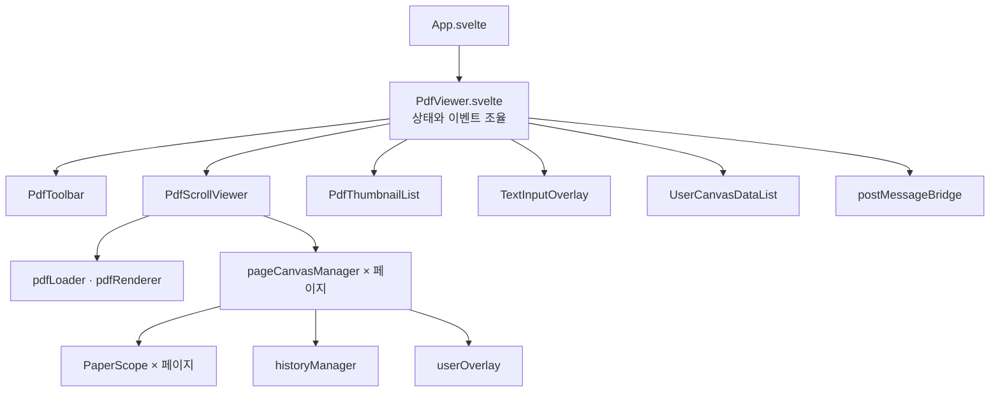
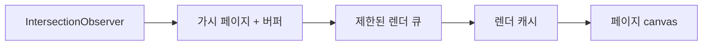

# Inko 아키텍처

Inko는 호스트 페이지, 브라우저 SDK, iframe 뷰어의 세 부분으로 동작합니다.
공개 v1 통합 표면은 `window.Inko`와 `postMessage` 프로토콜입니다.


## 책임 경계

Inko가 제공하는 기능:

- URL 또는 Base64 PDF 로드
- 페이지별 편집과 편집 상태 반환·복원
- 복수 검토본 레이어 표시
- iframe 생명주기와 메시지 전달
- 테마·도구·언어 설정

호스트 앱이 맡는 기능:

- 사용자 인증과 문서·검토본 권한
- `canvasData` 저장, 버전 번호와 동시 수정 정책
- append-only 여부, 보존·백업·복구
- 정적 파일 배포, CSP·CORS·HTTPS 설정
- 업데이트 적용과 대상 환경 검증

Inko의 저장·복원 흐름은 commit·checkout에서 착안했지만 Git 저장소, diff,
merge, branch 또는 불변 감사 로그를 구현하지 않습니다.

## 뷰어 레이어



| 레이어 | 역할 |
| --- | --- |
| 오케스트레이션 | 문서·페이지·도구 상태를 소유하고 컴포넌트 이벤트 조율 |
| 뷰 | 툴바, 스크롤 페이지, 썸네일, 텍스트 입력과 검토본 목록 렌더링 |
| 편집 엔진 | 페이지별 PaperScope, 그리기 도구, 선택, undo/redo, 직렬화 |
| PDF 엔진 | PDF.js 로드, 가시 페이지 렌더링, 썸네일과 캐시 |
| 통합 경계 | SDK와 iframe 사이 메시지 검증·전달 |

## 페이지별 PaperScope

Paper.js는 활성 project와 view 상태를 사용합니다. Inko는 PDF 페이지마다 별도의
`PaperScope`를 만들어 편집 캔버스와 직렬화 상태가 서로 섞이지 않게 합니다.

```text
페이지 1 → PaperScope 1 → PDF canvas + editable canvas
페이지 2 → PaperScope 2 → PDF canvas + editable canvas
페이지 3 → PaperScope 3 → PDF canvas + editable canvas
```

페이지 도구가 Paper.js API를 호출하기 전에 해당 scope를 활성화해야 합니다.

## 가시 페이지 렌더링

긴 문서에서 모든 페이지를 동시에 고해상도로 그리지 않습니다.
`IntersectionObserver`가 가시 범위를 추적하고, 렌더 큐가 주변 페이지를 포함해
필요한 작업만 실행합니다. 렌더 결과는 제한된 캐시에 보관합니다.



## 편집 상태

각 페이지의 Paper.js JSON을 페이지 번호로 묶어 하나의 `canvasData` 문자열로
인코딩합니다. SDK는 이 값을 해석하지 않고 호스트 콜백과 뷰어 사이에 그대로
전달합니다.

```text
Paper.js item
  → 페이지별 exportJSON()
  → 페이지 키를 가진 객체
  → canvasData 문자열
  → 호스트 저장소
```

포맷은 구현 버전과 함께 진화할 수 있으므로 호스트가 JSON 필드를 직접 수정하거나
부분 병합하지 않는 것이 안전합니다.

PDF.js 네이티브 양식 값은 문서 단위 `annotationStorage`에 있고,
`exportPdf()`가 `saveDocument()` 결과를 별도 `ArrayBuffer`로 반환합니다.
이 바이너리 경로와 Paper.js `canvasData` 경로는 서로 합성하지 않습니다.

## 통합 보안 모델

- SDK는 iframe의 `contentWindow`와 예상 origin이 일치하는 메시지만 처리합니다.
- 뷰어는 허용된 부모 origin의 메시지만 처리합니다.
- 첫 연결에서 확정된 부모 origin은 이후 메시지의 `targetOrigin`으로 사용합니다.
- URL·파일명·Base64·설정 payload의 타입과 크기를 검사합니다.
- same-origin 배치가 기본 경로이며, cross-origin 배치는 허용 origin과 CORS를
  명시해야 합니다.

이 검증은 호스트 서버의 인증과 권한 검사를 대체하지 않습니다.

## 확장 원칙

상태 모듈은 `create*` factory function으로 만들고 옵션 객체로 의존성을
주입합니다. 이 패턴은 Svelte 5 runes 상태를 closure에 캡슐화하면서 필요한
메서드와 getter만 노출합니다. 자세한 내용은
[Factory Function 패턴](factory-function-pattern.md)을 참고하세요.
