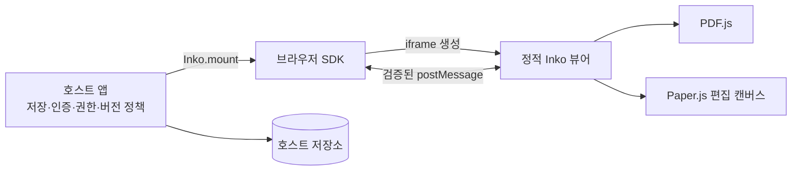
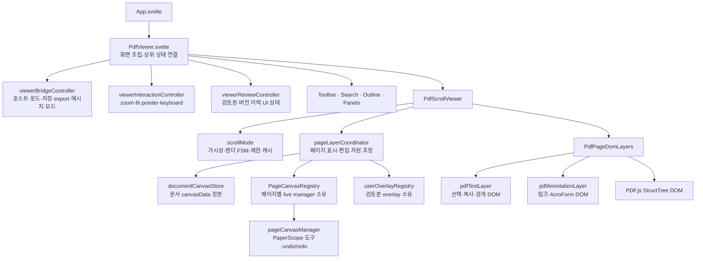
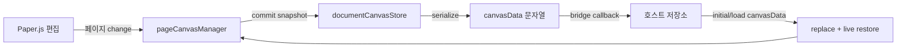

# Inko 아키텍처

Inko는 호스트 앱, 브라우저 SDK, self-hosted iframe 뷰어의 세 부분으로
동작합니다. 호스트는 PDF와 편집 상태의 영속성을 소유하고, Inko는 PDF 표시와
페이지별 편집 상태의 반환·복원 및 검토본 레이어 UI를 담당합니다.

## 공개 SDK 경계

배포 패키지는 private 소스 워크스페이스와 분리해 `release/`에서 만듭니다.
소스 트리의 `public/sdk/pdfv-sdk.js`와 `public/sdk/inko-sdk.d.ts`가 각각 배포
패키지의 `sdk/inko-sdk.js`와 `sdk/inko-sdk.d.ts`가 됩니다.

| 구분 | 호환성 계약 |
| --- | --- |
| 브라우저 API | `window.Inko`, `Inko.mount()`, `ViewerOptions`, `ViewerInstance`, 콜백과 오류 동작 |
| 편집 상태 | `canvasData` 문자열의 반환·복원, 검토본 입력과 현재 편집본 선택 의미 |
| iframe 연결 | SDK와 뷰어가 교환하는 검증된 `postMessage` 타입·payload·응답 상관관계 |
| self-hosted 진입점 | 패키지의 `viewer/index.html`과 `sdk/inko-sdk.js`·타입 선언 파일 |

`src/components/**`, `src/lib/**`, Svelte 컴포넌트 props, controller와 port는 내부
구현입니다. 특히 `src/lib/index.ts`의 `export`는 소스 내부 조립 편의를 위한 것이며,
private 루트 패키지는 소비자용 모듈 진입점이 아닙니다. 내부 factory를 공개 API로
추가하려면 명시적인 API 설계, 타입 선언, 패키지 포함, 호환성 테스트와 semver 판단이
먼저 필요합니다.

## 책임 경계

Inko가 제공하는 기능:

- URL 또는 Base64 PDF 로드
- 페이지별 편집과 편집 상태 반환·복원
- 복수 검토본 레이어 표시와 선택한 상태에서 이어서 편집
- iframe 생명주기와 메시지 전달
- 테마·도구·언어 설정

호스트 앱이 맡는 기능:

- 사용자 인증과 문서·검토본 권한
- `canvasData` 저장, 버전 번호와 동시 수정 정책
- append-only 여부, 보존·백업·복구
- 정적 파일 배포, CSP·CORS·HTTPS 설정
- 업데이트 적용과 대상 환경 검증

Inko의 저장·복원 흐름은 commit·checkout에서 착안했지만 Git 저장소, diff,
merge, branch 또는 불변 감사 로그를 구현하지 않습니다.

## 현재 내부 구조

`PdfViewer.svelte`는 화면 조립과 상위 상태 연결을 담당합니다. 세부 동작은
controller와 `PdfScrollViewer` 아래의 페이지 수명주기 계층으로 분리합니다.

### 상태 소유권

| 상태·자원 | 단일 소유자 | 소비·동기화 방식 |
| --- | --- | --- |
| PDF 문서, 파일명, 로드 세대, PDF.js `annotationStorage` | `pdfLoader` | `PdfViewer`와 bridge가 읽고 문서 교체를 요청 |
| 페이지 번호와 문서 페이지 수 | `pageNavigation` | 스크롤의 현재 페이지 이벤트를 상위 navigation에 반영 |
| zoom·fit-width·입력 모드·전역 입력 listener | `viewerInteractionController` | `PdfViewer`가 getter와 명령으로 연결 |
| 공개 검토본, 현재 편집본 ID, 버전 이력 모드, 패널 표시 | `viewerReviewController` | `PdfViewer`와 `PdfScrollViewer`에 읽기 전용 상태로 전달 |
| 호스트 연결 모드, 문서 로드 세대, 메시지 transport | `viewerBridgeController` | `postMessageBridge`를 감싸고 상위 작업을 호출 |
| 가시 페이지, 렌더 queue/FSM, bitmap cache, 진행 중 PDF.js task | `scrollMode` | `PdfScrollViewer` 인스턴스 수명에 종속 |
| 문서 전체의 직렬화 가능한 페이지별 Paper JSON | `documentCanvasStore` | 저장 snapshot과 연결된 live manager snapshot을 합쳐 `canvasData` 생성 |
| 페이지별 `pageCanvasManager`와 `PaperScope` 자원 | `PageCanvasRegistry` | store에 attach/detach하며 snapshot 후 dispose |
| 페이지별 검토본 Paper overlay | `userOverlayRegistry` | `pageLayerCoordinator`가 가시 페이지와 검토본 상태에 맞춰 교체 |
| TextLayer·AnnotationLayer·StructTree DOM | `PdfPageDomLayers` | 같은 PDF 페이지·logical viewport·`annotationCanvasMap`으로 만들고 coordinator에 준비 완료 통지 |
| 페이지별 undo/redo snapshot | `PdfScrollViewer`가 만든 `historyManager` | page manager가 페이지별 snapshot을 기록하고 현재 페이지 가능 상태만 상위로 통지 |
| 저장된 문서·권한·버전·백업 | 호스트 앱 | Inko가 반환한 값을 호스트 정책으로 보관하고 다시 주입 |

`documentCanvasStore`의 “정본”은 현재 뷰어 인스턴스 안에서 직렬화할 편집 상태를
뜻합니다. 서버 저장소나 영속성 계층이 아니며, 문서 교체 시 `replace()` 입력을
완전한 기준선으로 취급합니다. 가시 페이지의 live manager가 내려갈 때 registry가
snapshot을 확정하므로 가상화가 편집 내용을 잃지 않습니다.

## PDF 페이지 표시 계층

`scrollMode`는 PDF.js 렌더 결과 canvas에 렌더에 사용한 `PDFPageProxy`, CSS 기준
logical viewport와 `annotationCanvasMap`을 함께 보관합니다. `PdfPageDomLayers`는
이 메타데이터로 다음 DOM 계층을 같은 좌표계에 만듭니다.

- TextLayer: 텍스트 선택·복사와 검색 highlight
- AnnotationLayer: 링크, 위젯과 AcroForm 입력
- StructTree: 접근성 의미 구조
- Paper canvas: Inko의 편집 가능한 펜·형광펜·텍스트·도형 상태
- review overlay: 호스트가 제공한 다른 검토본의 읽기 전용 레이어

Text/Annotation/StructTree는 PDF.js 문서 표현이며 `canvasData`에 저장하지 않습니다.
Paper canvas와 review overlay의 자원·상태는 `pageLayerCoordinator`가 별도로
조정합니다.

## 편집 상태 흐름

포맷은 구현 버전과 함께 진화할 수 있으므로 호스트가 JSON 필드를 직접 수정하거나
부분 병합하지 않는 것이 안전합니다.

PDF.js 네이티브 양식 값은 문서 단위 `annotationStorage`에 있고,
`exportPdf()`가 `saveDocument()` 결과를 별도 `ArrayBuffer`로 반환합니다.
이 바이너리 경로와 Paper.js `canvasData` 경로는 서로 합성하지 않습니다.

`exportFlattenedPdf()`는 명시적으로 두 경로를 전달본에서만 합칩니다.
`viewerBridgeController`가 live manager를 포함한 `documentCanvasStore` snapshot과
`saveDocument()` 바이트를 고정하고, `pdfCanvasFlatten`이 PDF.js 1.0 viewport의
`convertToPdfPoint()`를 사용해 CropBox·rotation을 반영한 뒤 모든 페이지의
Path/PointText를 PDF content로 기록합니다. Helvetica로 인코딩 가능한 PointText는
PDF 텍스트로 기록하고, 그 밖의 Unicode PointText는 OFL Pretendard를 실제
fallback 시점에만 불러 4배 해상도 투명 PNG로 시각 평탄화합니다. 이 경로는
`TEXT_RASTERIZED` warning으로 명시되어 선택 가능한 PDF 텍스트와 혼동되지
않습니다. 처리 결과는 bounded issue 목록과 전체 집계를 반환하며, 지원하지
않거나 손상된 객체를 조용히 버리지 않습니다.

평탄화 결과는 편집 가능한 `canvasData`를 담지 않는 파생 전달본입니다. 호스트의
원본 PDF·편집 상태 저장 책임은 그대로이며, content rewrite는 기존 CMS/PAdES
서명을 보존하지 못합니다.

## 비동기 수명주기 규칙

- component 또는 factory를 만든 계층이 timer, DOM listener, PDF.js render task,
  observer와 하위 registry를 정리할 책임도 집니다.
- 문서·페이지·DOM presentation이 바뀌는 비동기 작업은 generation을 캡처하고,
  완료 시 현재 generation과 resource identity를 다시 확인합니다.
- `dispose()` 이후 완료된 Promise는 cache, FSM, DOM 또는 외부 callback을
  갱신하지 않습니다.
- 페이지 가상화 해제는 live 편집 상태 snapshot 후 DOM·Paper 자원을 분리하고,
  문서 교체·뷰어 종료는 남은 waiter와 하위 자원을 모두 종료합니다.

## 통합 보안 모델

- SDK는 iframe의 `contentWindow`와 예상 origin이 일치하는 메시지만 처리합니다.
- 뷰어는 허용된 부모 origin의 메시지만 처리합니다.
- 첫 연결에서 확정된 부모 origin은 이후 메시지의 `targetOrigin`으로 사용합니다.
- URL·파일명·Base64·설정 payload의 타입과 크기를 검사합니다.
- same-origin 배치가 기본 경로이며, cross-origin 배치는 허용 origin과 CORS를
  명시해야 합니다.

이 검증은 호스트 서버의 인증과 권한 검사를 대체하지 않습니다.

## 확장 원칙

상태 모듈은 `create*` factory function으로 만들고 옵션 객체로 의존성을
주입합니다. 이 패턴은 Svelte 5 runes 상태를 closure에 캡슐화하면서 필요한
메서드와 getter만 노출합니다. 자세한 내용은
[Factory Function 패턴](factory-function-pattern.md)을 참고하세요.
