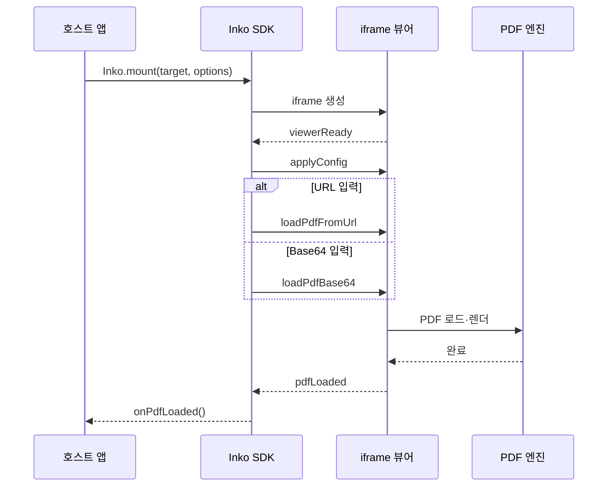
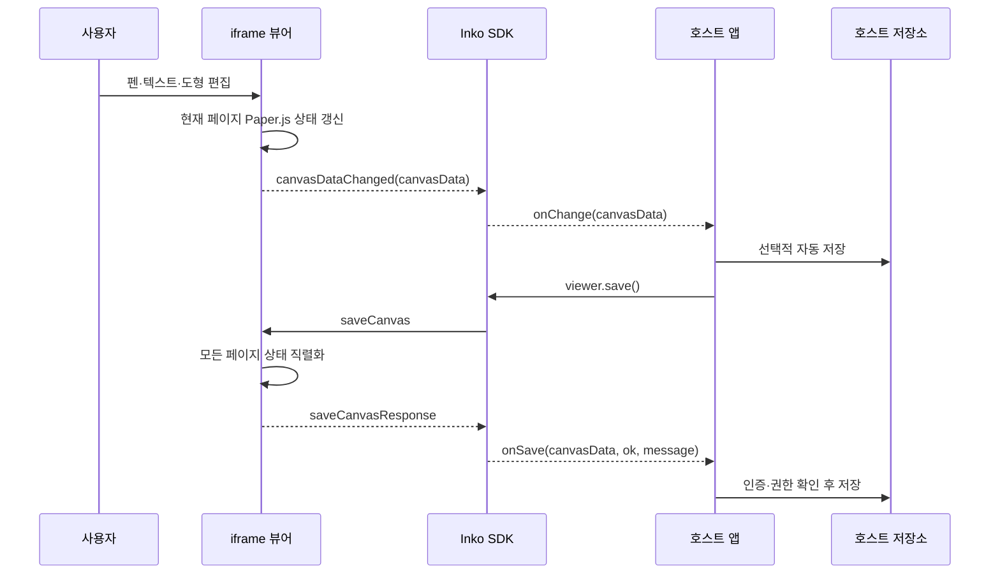
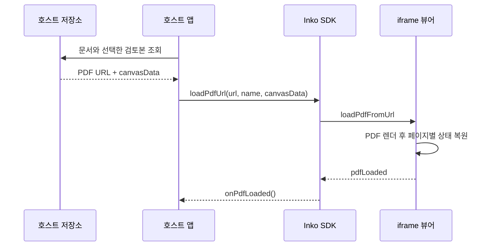
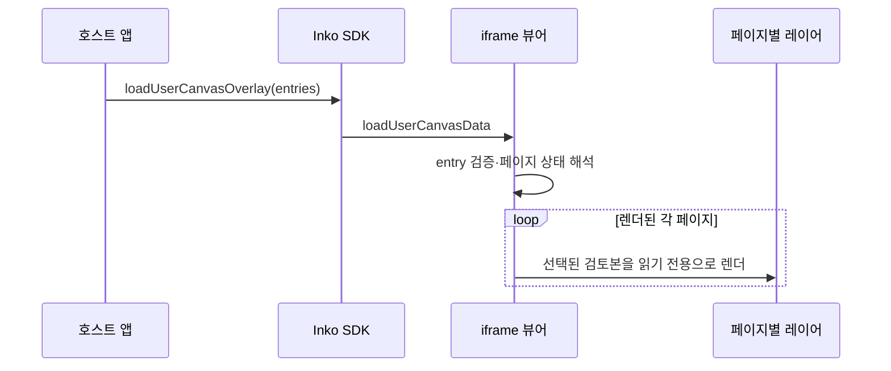
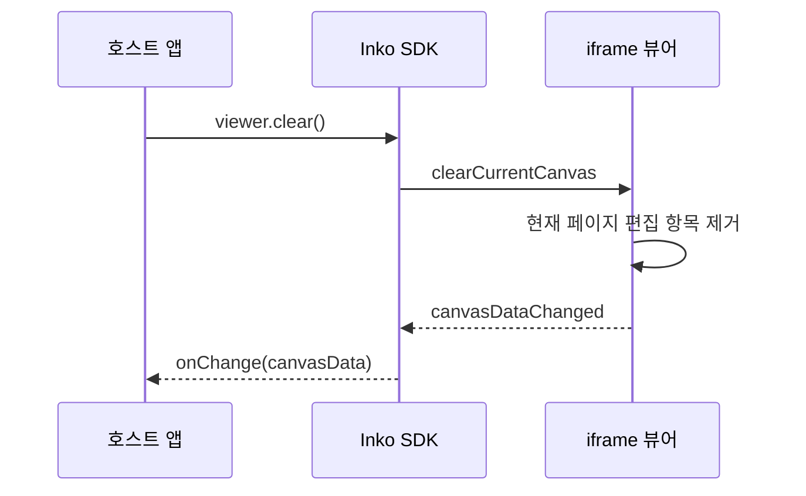

# Inko 데이터 흐름

공개 v1은 호스트 페이지와 iframe 뷰어가 `postMessage`로 통신합니다. 호스트는
`Inko.mount()`로 뷰어를 열고, SDK가 메시지의 source와 origin을 검증해 전달합니다.

## 연결과 초기 PDF 로드



SDK는 `viewerReady` 전에 호출된 작업을 큐에 보관하고 연결이 완료되면 순서대로
전송합니다. 초기 `canvasData`가 있으면 PDF 입력과 함께 전달해 편집 상태를
복원합니다.

## 편집과 상태 저장



`canvasDataChanged`는 편집마다 발생할 수 있으므로 자동 저장은 호스트에서
debounce하는 것이 좋습니다. `save()`는 저장소에 직접 쓰지 않고 현재 상태를
`onSave`에 반환합니다.

네이티브 AcroForm을 PDF 바이트로 저장하는 경로는 `canvasData`와 분리됩니다.
`viewer.exportPdf()`는 request ID를 포함한 `exportPdf` 메시지를 보내고,
뷰어가 PDF.js `saveDocument()` 결과를 `exportPdfResponse`의 transferable
`ArrayBuffer`로 돌려주면 해당 Promise만 완료합니다. Paper.js 편집 상태는 이
응답에 포함되지 않습니다.

## 저장 상태 복원



검토본 선택, 최신 버전 판정, 충돌 처리와 수정 권한은 호스트에서 결정합니다.
Inko는 전달받은 상태에서 편집을 이어갈 수 있게 복원합니다.

## 검토본 레이어



공개 SDK의 레이어 항목은 다음 형태입니다.

```typescript
interface UserCanvasEntry {
  canvasId: string
  userName: string
  canvasData: string
  enabled?: boolean
  color?: string
}
```

레이어는 현재 편집 캔버스와 분리됩니다. 표시 여부를 바꿔도 원본 검토본의
`canvasData`는 수정되지 않습니다.

## 현재 페이지 초기화



`clear()`의 범위는 현재 페이지입니다. 전체 문서 상태 삭제나 저장소 버전 삭제는
호스트가 별도 확인 절차를 거쳐 처리해야 합니다.

## 메시지 방향

| 방향 | 메시지 | 용도 |
| --- | --- | --- |
| SDK → 뷰어 | `loadPdfBase64` | Base64 PDF와 선택적 상태 로드 |
| SDK → 뷰어 | `loadPdfFromUrl` | URL PDF와 선택적 상태 로드 |
| SDK → 뷰어 | `loadUserCanvasData` | 검토본 레이어 목록 로드 |
| SDK → 뷰어 | `saveCanvas` | 현재 문서 상태 요청 |
| SDK → 뷰어 | `exportPdf` | request ID 기반 네이티브 PDF 바이트 요청 |
| SDK → 뷰어 | `clearCurrentCanvas` | 현재 페이지 편집 상태 초기화 |
| SDK → 뷰어 | `applyConfig` | 테마·도구·언어 부분 갱신 |
| 뷰어 → SDK | `viewerReady` | 연결 준비 완료 |
| 뷰어 → SDK | `pdfLoaded` | PDF 로드 완료 |
| 뷰어 → SDK | `canvasDataChanged` | 편집 상태 변경 |
| 뷰어 → SDK | `saveCanvasResponse` | 저장 요청 결과 |
| 뷰어 → SDK | `exportPdfResponse` | 같은 request ID의 PDF `ArrayBuffer` 결과 |
| 뷰어 → SDK | `closeViewer` | 닫기 요청 |
| 뷰어 → SDK | `setOrientation` | 방향 변경 요청 |

## 신뢰 경계

1. SDK는 자신이 만든 iframe의 `contentWindow`에서 온 메시지만 처리합니다.
2. SDK는 `src`에서 계산한 origin과 일치하는 메시지만 처리합니다.
3. 뷰어는 같은 origin 또는 빌드 시 허용한 부모 origin만 신뢰합니다.
4. 메시지 타입, 필수 필드, 문자열 길이와 허용 URL scheme을 확인합니다.
5. `readOnly`와 클라이언트 검증은 서버의 인증·권한 검사를 대신하지 않습니다.

관련 설정과 배포 책임은 [통합 가이드](integration-guide.md), 컴포넌트 구조는
[아키텍처](architecture.md)를 참고하세요.
